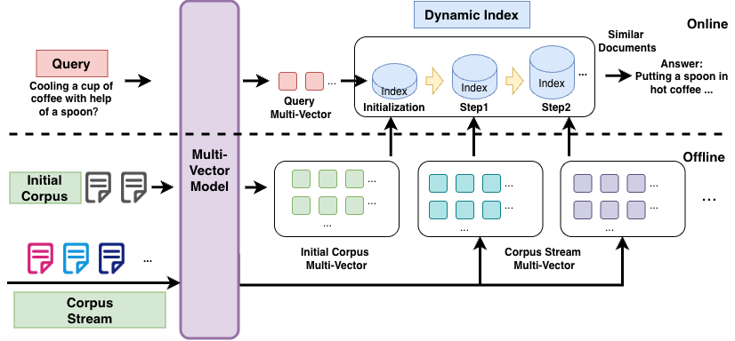
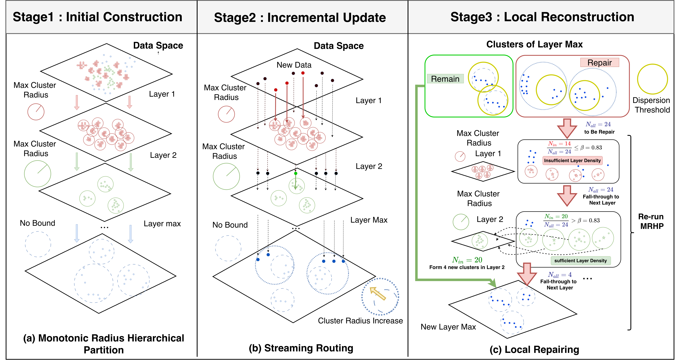

# StreamPLAID: Efficient Incremental Indexing via Monotonic Radius Hierarchical Partitioning for Multi-Vector Retrieval

This repository contains the official implementation of **StreamPLAID**, a framework designed for efficient incremental indexing in streaming multi-vector retrieval (MVR) workloads.

## Abstract
With the increasing adoption of Retrieval-Augmented Generation (RAG) and LLM-based agents, information retrieval (IR) is a core part of modern data systems. Among existing approaches, multi-vector retrieval (MVR) has shown strong performance in handling complex queries by preserving fine-grained semantic representations. However, supporting continuous updates in MVR remains challenging. Most existing systems rely on static partitioning, which works well for offline construction but incurs high maintenance costs in dynamic settings, leading to significant write amplification or degraded performance under data distribution shifts.

To address bottlenecks, we propose **StreamPLAID**, a framework designed for efficient incremental indexing in streaming MVR workloads. StreamPLAID introduces **Monotonic Radius Hierarchical Partitioning (MRHP)**, transforming flat clustering into a multi-layer architecture with a provable $O(1)$ approximation guarantee for centroid optimality. Building on MRHP, we design a routing strategy that separates stable regions from frequently changing ones, so that updates can be handled locally without triggering expensive global re-clustering. Furthermore, to manage continuous concept drift, a **Spatiotemporal Maintenance Operator** dynamically triggers re-clustering whenever the observed quantization error deviates from theoretical ideals. By leveraging lightweight **Clustering Features (CF)** to pinpoint and reconstruct only the degraded local partitions. Extensive evaluations demonstrate that StreamPLAID achieves improvements in index update efficiency compared to state-of-the-art baselines and guarantees high retrieval accuracy under both in-domain and out-of-domain incremental datasets.

## Overview

### 1. Dynamic Data in Multi-Vector Retrieval

*Figure 1: Illustration of the challenges and mechanisms of dynamic data updates in Multi-Vector Retrieval systems.*

### 2. The StreamPLAID Methodology

*Figure 2: The core architecture of StreamPLAID, highlighting Monotonic Radius Hierarchical Partitioning (MRHP) and the Spatiotemporal Maintenance Operator.*

## Hardware Environment

All experiments, benchmarks, and evaluations reported in the paper were conducted on a high-performance server with the following hardware specifications:

| Component | Specification | Phase Usage |
| :--- | :--- | :--- |
| **CPU** | 96-core Intel(R) Xeon(R) Platinum 8468 | Indexing & Retrieval |
| **System Memory** | 2 TB RAM | Indexing & Retrieval |
| **GPU** | NVIDIA H100 (80GB VRAM) | Embedding Generation |

> **Note:** The embedding generation phase strictly utilizes the GPU (H100) for acceleration. To evaluate the pure algorithmic efficiency of our indexing and search components, all indexing constructions and retrieval operations are executed exclusively on the CPU.